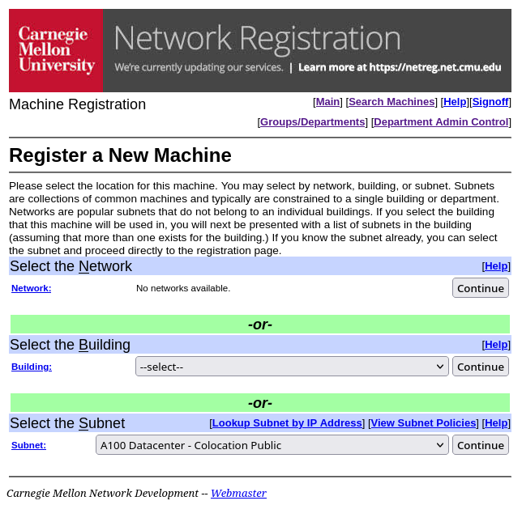
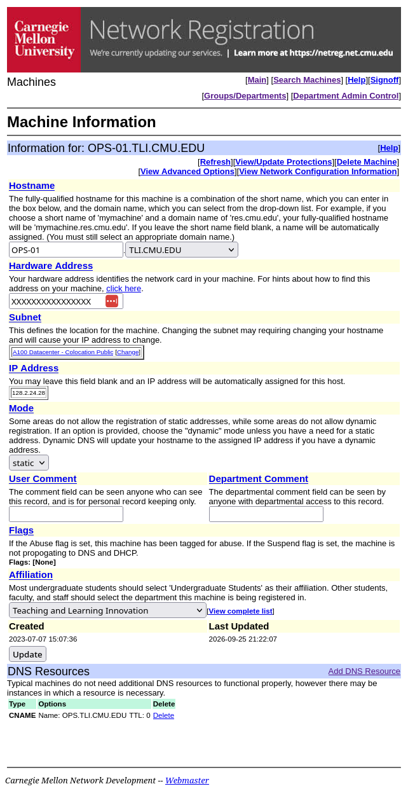
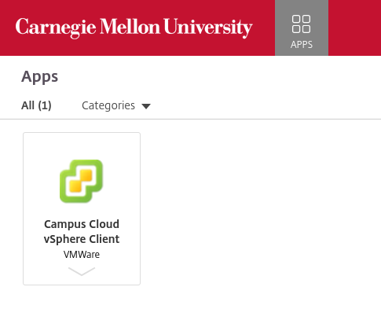
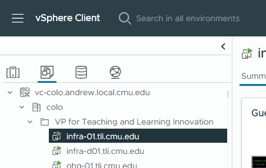
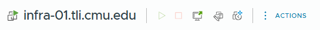

# Set up a Campus Cloud VM

Campus Cloud is CMU's on-campus VM service. The Campus Cloud Team provisions
the virtual hardware, storage, and console; we install and manage NixOS and
the services running on it. Request the VM and register it on the network,
then boot the NixOS installer to begin fleet enrollment.

## Request the VM

Open the [new server request form](https://cmu.service-now.com/go/CampusCloudNewServer)
and fill in the fields according to the table below. The form is also linked
as **Request a New (Virtual) Server** under
**Existing Customers** in the **Request** section of its
[Campus Cloud service page](https://www.cmu.edu/computing/services/infrastructure/server/campus-cloud/index.html).

A reasonable default is 2 vCPU, 4 GB RAM, and a 40 GB system disk. If the
host will hold substantial state, request an additional disk sized for
that data instead of enlarging the system disk. The additional disk can be
mounted at the service's data path without mixing its state with the OS.

| Form section | Field | Guidance |
| --- | --- | --- |
| Requester | Name, Phone | You. |
| | Department | Where the VM will belong: Eberly Center, VPTLI, Core Competencies, or Online Education. |
| Secondary Contact | Name, Phone | Usually blank; optional ticket watcher. |
| New Server Specifications | Proposed Server Name | [Host FQDN](../README.md#choose-host-and-service-names) (e.g., `www-02.tli.cmu.edu`). |
| | Intended OS | Linux/Other: NixOS. |
| | Version | Leave blank. |
| | OVF template location | Leave blank unless importing a VM. |
| | Public, Private, or NAT Subnet | Public. |
| Server Configuration | Number of CPUs | At least `2`. |
| | Amount of RAM | At least `4` GB. |
| | System Disk Space (GB) (Solid State) | `40` GB, unless the OS needs more. |
| Additional Storage in Secondary Disk | Size of New Disk (GB) | Only if needed. |
| Payment Information | Oracle String | Use the Oracle string for the Requester department above. |
| Additional Comments | Additional Comments | Leave blank. |

## Register the VM on the network

The Campus Cloud Team includes the VM's MAC address in the ticket resolution
message once the VM has been created. Go to [Network Registration](https://netreg.net.cmu.edu/),
select **Enter**, sign in, and select **Register New Machine**.

### Select the subnet

The first registration screen is for choosing the VM's subnet.

Under **Select the Subnet**, choose `A100 Datacenter - Colocation Public`.

Select **Continue** beside that dropdown.

The subnet selection page:

### Enter the machine details

Complete the registration form:

| Field | Enter |
| --- | --- |
| Hostname | The short name and domain from the requested FQDN; for `www-02.tli.cmu.edu`, enter `www-02` and select `tli.cmu.edu`. |
| Hardware Address | The MAC address from the ticket resolution message. |
| Affiliation | The department from the VM request. For VPTLI, NetReg lists **Teaching and Learning Innovation**. |

Select **Continue** to create the machine record.

A Machine Information page:

### Add service CNAMEs

> [!NOTE]
> This procedure is for a single-host service. Service pools are not covered
> here.

On the Machine Information page, select **View Advanced Options**.

Under **DNS Resources**, select **Add Resource** and add the service name as a
CNAME for this host (e.g., `www.tli.cmu.edu` for
`www-02.tli.cmu.edu`). Create additional CNAMEs for other services running on
the host as needed.

> [!CAUTION]
> If the service name already points to another host, leave it there until the
> new host is ready. Then delete the CNAME resource from the old machine's
> Machine Information page and add it to the new one's page.

After registering a machine or making any other NetReg change, wait up to 15
minutes for the change to take effect and up to another 15 minutes for DNS
propagation.

Do not continue until the host FQDN resolves to the VM's assigned IP address.

## Prepare the VM

### Access the VM administration console

Go to [apps.cmu.edu](https://apps.cmu.edu/), sign in, and open the Campus Cloud
vSphere Client.

The Campus Cloud vSphere Client in Apps:

If the portal says **No apps available**, email
[Campus-Cloud-Help@cmu.edu](mailto:Campus-Cloud-Help@cmu.edu) and ask for access
to the VM administration console at [apps.cmu.edu](https://apps.cmu.edu/).

In the Campus Cloud vSphere Client, sign in with your Andrew username (no
@andrew.cmu.edu) and your Andrew password.

> [!NOTE]
> The login screen is labeled **VMware® vSphere** and does not look like the
> usual CMU SSO screen.

### Find the VM

In the inventory pane, select the second icon, **VMs and Templates**.

Expand `vc-colo.andrew.local.cmu.edu`, then `colo`, then
`VP for Teaching and Learning Innovation`, and select the newly created VM.

The VM inventory pane:

### Meet the Toolbar

Beside the hostname is a toolbar. From left to right, its buttons are
**Power On**, **Power Off**, **Launch Console**, **Edit Settings**, and
**Take Snapshot**. The first four are relevant here. Hover over an icon to see
its name.

The toolbar:

### Attach the NixOS installer ISO

Select **Edit Settings** from the toolbar.

Under **Virtual Hardware**, find **CD/DVD drive 1**. Choose **Datastore ISO
File** from its dropdown to open the **Select File** dialog.

In **Select File**, click the `shared_vast-01_colomedia` datastore to browse its
contents, expand the collapsed **Linux** folder, then click **NixOS**.

Choose the latest stable minimal installer ISO, e.g.
`nixos-minimal-26.05.9843.b67c7a60c373-x86_64-linux.iso`, then select **OK**
to return to **Edit Settings**.

Expand **CD/DVD drive 1**, check **Connect at Power On**, then select **OK** to
save the VM settings.

### Boot the installer

Select **Power On** from the toolbar, then quickly select **Launch Console** to
open a web console.

Click inside the web console to give it keyboard focus, then press **Escape**
during startup to open the boot menu.

Use the arrow keys to select **CD-ROM Drive**, then press **Enter**.

At the NixOS installer menu, use the arrow keys to select the **NixOS** entry
ending in **(Linux LTS)**, then press **Enter**.

When the installer reaches the `nixos@nixos` prompt, continue with
[Prepare to install](../README.md#prepare-to-install).
